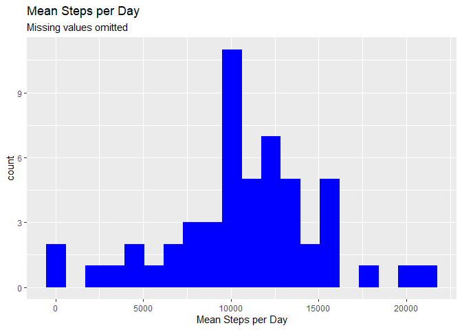
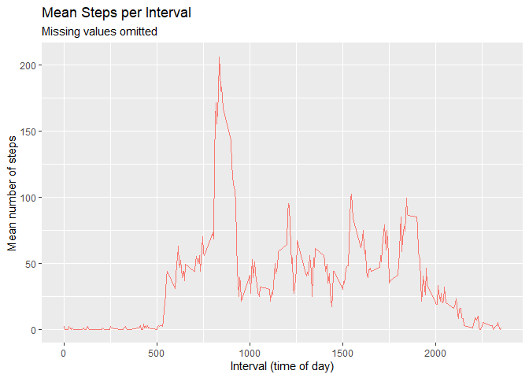
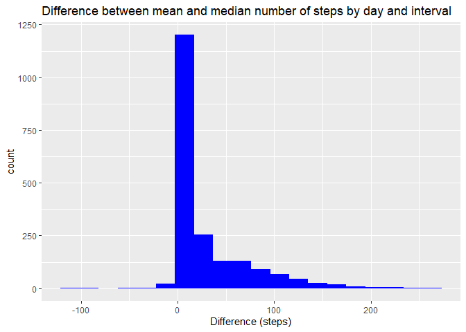
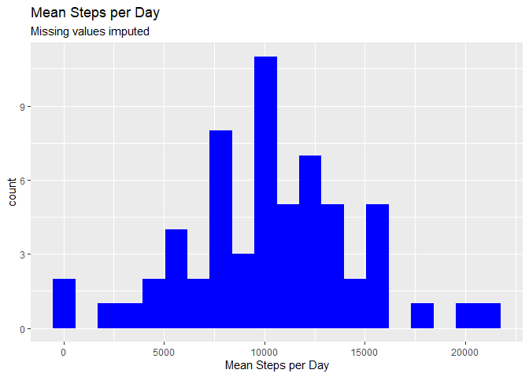
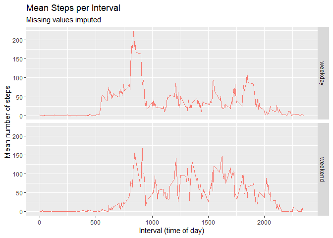

## 1. Loading and preprocessing the data

We begin under the assumption that the data archive - provided as `activity.zip` - has been opened and the data themselves extracted to the working directory as `activity.csv`.

First, bring in needed libraries:


``` r
library(tidyverse)
```

```
## Warning: package 'lubridate' was built under R version 4.5.3
```

```
## ── Attaching core tidyverse packages ──────────────────────── tidyverse 2.0.0 ──
## ✔ dplyr     1.2.0     ✔ readr     2.2.0
## ✔ forcats   1.0.1     ✔ stringr   1.6.0
## ✔ ggplot2   4.0.2     ✔ tibble    3.3.1
## ✔ lubridate 1.9.5     ✔ tidyr     1.3.2
## ✔ purrr     1.2.1     
## ── Conflicts ────────────────────────────────────────── tidyverse_conflicts() ──
## ✖ dplyr::filter() masks stats::filter()
## ✖ dplyr::lag()    masks stats::lag()
## ℹ Use the conflicted package (<http://conflicted.r-lib.org/>) to force all conflicts to become errors
```
### 1.1 - Loading data

Read the data into R as the dataframe `act_data`.  
Learning something about the structure and content of the data before beginning is always beneficial:


``` r
act_data <- read.csv('activity.csv', colClasses = c('numeric', 'Date', 'numeric'))
str(act_data)
```

```
## 'data.frame':	17568 obs. of  3 variables:
##  $ steps   : num  NA NA NA NA NA NA NA NA NA NA ...
##  $ date    : Date, format: "2012-10-01" "2012-10-01" ...
##  $ interval: num  0 5 10 15 20 25 30 35 40 45 ...
```

``` r
summary(act_data)
```

```
##      steps             date               interval     
##  Min.   :  0.00   Min.   :2012-10-01   Min.   :   0.0  
##  1st Qu.:  0.00   1st Qu.:2012-10-16   1st Qu.: 588.8  
##  Median :  0.00   Median :2012-10-31   Median :1177.5  
##  Mean   : 37.38   Mean   :2012-10-31   Mean   :1177.5  
##  3rd Qu.: 12.00   3rd Qu.:2012-11-15   3rd Qu.:1766.2  
##  Max.   :806.00   Max.   :2012-11-30   Max.   :2355.0  
##  NA's   :2304
```

``` r
head(act_data, 15)
```

```
##    steps       date interval
## 1     NA 2012-10-01        0
## 2     NA 2012-10-01        5
## 3     NA 2012-10-01       10
## 4     NA 2012-10-01       15
## 5     NA 2012-10-01       20
## 6     NA 2012-10-01       25
## 7     NA 2012-10-01       30
## 8     NA 2012-10-01       35
## 9     NA 2012-10-01       40
## 10    NA 2012-10-01       45
## 11    NA 2012-10-01       50
## 12    NA 2012-10-01       55
## 13    NA 2012-10-01      100
## 14    NA 2012-10-01      105
## 15    NA 2012-10-01      110
```

``` r
tail(act_data, 15)
```

```
##       steps       date interval
## 17554    NA 2012-11-30     2245
## 17555    NA 2012-11-30     2250
## 17556    NA 2012-11-30     2255
## 17557    NA 2012-11-30     2300
## 17558    NA 2012-11-30     2305
## 17559    NA 2012-11-30     2310
## 17560    NA 2012-11-30     2315
## 17561    NA 2012-11-30     2320
## 17562    NA 2012-11-30     2325
## 17563    NA 2012-11-30     2330
## 17564    NA 2012-11-30     2335
## 17565    NA 2012-11-30     2340
## 17566    NA 2012-11-30     2345
## 17567    NA 2012-11-30     2350
## 17568    NA 2012-11-30     2355
```

We are told that there are missing values (NAs) in the data, and our first look confirms this. How are these NAs distributed?


``` r
data.frame(na_steps = sum(is.na(act_data$steps)), 
           na_date = sum(is.na(act_data$date)),
           na_interval = sum(is.na(act_data$interval)))
```

```
##   na_steps na_date na_interval
## 1     2304       0           0
```

From the output of this command we see that there are 2304 NA values, all in the 'steps' variable. We will need to take this into consideration during our analysis.

### 1.2 - Preprocessing, transforming, and supplementing data to render it useful for analysis.

Because the reading the brief in its entirety before beginning tells us that we will be concerned with days of the week, weekdays vs. weekends, and NA values, we will add columns to the activity data. While not strictly necessary at this point, adding these columns now will carry them through the analysis and simplify later data manipulations and programming.  

First, to add the abbreviated name of the day:


``` r
act_data$day <- weekdays.Date(act_data$date, abbreviate = TRUE)
```

Next, the number of the day of the week, beginning with Sunday as 1.


``` r
act_data$dow <- wday(act_data$date)
```

Next, an either/or variable to indicate weekday or weekend.


``` r
act_data <- act_data |> 
    mutate(day_type = case_when(
        wday(date) %in% c(1, 7) ~ "weekend",
        wday(date) %in% c(2, 3, 4, 5, 6) ~ 'weekday'
    )
)
```

And finally combine the day of the week (as a number) and interval to form a singular key to each interval on each day of the week.


``` r
act_data$day_interval <- paste(act_data$dow, act_data$interval)
```

With these preliminary manipulations completed, we can move on to the analysis itself.

## 2. What is the mean total number of steps taken per day?

### 2.1 - Generate a histogram of the total number of steps per day

First, to generate a histogram of the number of steps taken each day we need to prepare our data:

* Group by **date**   
* Sum each day using the `summarise()` function to create a new variable


``` r
steps_per_day <- act_data |> 
    group_by(date) |> 
    summarise(daily = sum(steps))
```

And plot the histogram via ggplot2:  


``` r
ggplot(data = steps_per_day) +
    geom_histogram(aes(x = daily), 
                   bins = 20, na.rm = TRUE,
                   fill = 'blue') +
    labs(title = 'Mean Steps per Day',
         subtitle = 'Missing values omitted',
         x = 'Mean Steps per Day')
```

<!-- -->

### 2.2 - Mean and median steps per day

We are also interested in the mean and median steps per day.

The calculation of these quantities is accomplished using the steps_per_day dataframe created earlier, via the `summarise()` function:


``` r
mean_med_daily <- steps_per_day |> 
    summarise(mean_daily_steps = round(mean(daily, na.rm = TRUE), 0),
              median_daily_steps = round(median(daily, na.rm = TRUE), 0)
              )

mean_med_daily
```

```
## # A tibble: 1 × 2
##   mean_daily_steps median_daily_steps
##              <dbl>              <dbl>
## 1            10766              10765
```

## 3. What is the average daily activity pattern?

### 3.1 - Time series plot of mean number of steps per interval

To investigate this, we will need to group the data by five-minute interval and calculate the mean for each interval, again rounding to whole numbers:


``` r
steps_per_interval <- act_data |> 
    group_by(interval) |> 
    summarise(steps = round(mean(steps, na.rm = TRUE),0))
```

And draw a time-series plot:  


``` r
ggplot(data = steps_per_interval) +
    geom_line(aes(x = interval, y = steps, color = 'red')) +
    labs(title = 'Mean Steps per Interval',
         subtitle = 'Missing values omitted',
         x = 'Interval (time of day)',
         y = 'Mean number of steps') +
    theme(legend.position = 'none')
```

<!-- -->

### 3.2 - Which interval contains, on average, the greatest number of steps?   

We determine this from the dataframe we created above, via the dplyr `filter()` function, and print:


``` r
max_steps_interval <- steps_per_interval |> 
        filter(steps == max(steps, na.rm = TRUE))
print.default(paste('Interval ', max_steps_interval[, 1], ' had, on average, the most steps: ',
              max_steps_interval[, 2], '.', sep = ''))
```

```
## [1] "Interval 835 had, on average, the most steps: 206."
```

## 4. Imputing missing values

### 4.1 - Calculate and report the number of missing values

We can use the same check we used in our initial exploration to report the number of rows with missing (NA) values:  


``` r
data.frame(na_rows_steps = sum(is.na(act_data$steps)), 
                        na_rows_date = sum(is.na(act_data$date)),
                        na_rows_interval = sum(is.na(act_data$interval)))
```

```
##   na_rows_steps na_rows_date na_rows_interval
## 1          2304            0                0
```

### 4.2 - Devise a strategy to replace missing values

We will need a strategy to "fill in the blanks." Based upon the data available, two options immediately present themselves:

1. Replace NA values with the mean number of steps for a given interval
2. Replace NA values with the median number of steps for a given interval

Further examination of these possibilities raises the thought that all days do not have the same activity pattern (*e.g.* weekends will likely be dissimilar to weekdays). Therefore, we can refine these options to consider the day of the week in our imputation of missing values.

1. Replace NA values with the mean number of steps for a given interval *on the same day of the week* as the missing value.
2. Replace NA values with the median number of steps for a given interval *on the same day of the week* as the missing value.

We generate a table of replacement values and examine the result:


``` r
fill_interval_steps <- act_data |> 
    group_by(day_interval) |> 
    summarise(median_steps = median(steps, na.rm = TRUE),
              mean_steps = round(mean(steps, na.rm = TRUE), 0))

head(fill_interval_steps, 20)
```

```
## # A tibble: 20 × 3
##    day_interval median_steps mean_steps
##    <chr>               <dbl>      <dbl>
##  1 1 0                     0          0
##  2 1 10                    0          0
##  3 1 100                   0          0
##  4 1 1000                  0         96
##  5 1 1005                  0        102
##  6 1 1010                  0        101
##  7 1 1015                  0        123
##  8 1 1020                  0        131
##  9 1 1025                  0        198
## 10 1 1030                 36        148
## 11 1 1035                  0        159
## 12 1 1040                  0        129
## 13 1 1045                  0         65
## 14 1 105                   0          5
## 15 1 1050                 35         70
## 16 1 1055                 39         89
## 17 1 110                   0          0
## 18 1 1100                 33         84
## 19 1 1105                 16         72
## 20 1 1110                 35         74
```

A visual inspection of the resulting replacement data reveals intervals for which we have a high mean, but a median of zero. We therefore investigate further by making a quick exploratory plot and immediately note the disparity between median and mean for many intervals:


``` r
ggplot(data = fill_interval_steps) +
    geom_histogram(aes(x = (mean_steps - median_steps)), bins = 20, fill = 'blue') +
    labs(title = 'Difference between mean and median number of steps by day and interval',
         x = 'Difference (steps)')
```

<!-- -->

Using the mean as a replacement for the NA values might skew the results high, and the median might skew them low. We propose to mitigate these potential effects by using a composite measure (average of the mean and median for the specific day and interval) as replacement values for missing data.

We add the the column to our replacement table thus:


``` r
fill_interval_steps <- fill_interval_steps |> 
    mutate(composite_repl = round((mean_steps + median_steps) / 2, 0))
```

### 4.3 - Create new data set with missing values filled in

We apply the replacement table to the original data, and create a new data set without NA values.


``` r
act_data_filled <- transform(
    act_data, 
    steps = ifelse(is.na(act_data$steps),
                   fill_interval_steps$composite_repl[match(act_data$day_interval, fill_interval_steps$day_interval)],
                   act_data$steps))
```

### 4.4 a - Plot a histogram of the mean number of steps per day using the new data set

Sum the steps again, grouped by date:


``` r
steps_per_date_filled <- act_data_filled |> 
    group_by(date) |> 
    summarise(daily = sum(steps))
```

Plot a histogram of the total number of steps per date, with the new data set:


``` r
ggplot(data = steps_per_date_filled) +
    geom_histogram(aes(x = daily), 
                   bins = 20, na.rm = TRUE,
                   fill = 'blue') +
    labs(title = 'Mean Steps per Day',
         subtitle = 'Missing values imputed',
         x = 'Mean Steps per Day')
```

<!-- -->

### 4.4 b - Calculate and report mean and median steps per day using the new data set

And calculate the mean and median:


``` r
mean_med_daily_filled <- steps_per_date_filled |> 
    summarise(mean_daily_steps = round(mean(daily, na.rm = TRUE), 0),
              median_daily_steps = round(median(daily, na.rm = TRUE), 0)
              )
mean_med_daily_filled
```

```
## # A tibble: 1 × 2
##   mean_daily_steps median_daily_steps
##              <dbl>              <dbl>
## 1            10263              10395
```

These values differ from those calculated in section 2 above:

| Missing value replacement | Mean number of steps | Median number of steps |
| -----: | -----: | -----: |
| **None** | 10 766 | 10 765 |
| **Composite** | 10 263 | 10 395 |
| *Difference* | *- 503* | *- 370* |
| *percent difference* | *- 4.7%* | *- 3.4%* |

In this case, imputing missing data slightly reduces the mean and median estimate of the daily number of steps.

## 6. Are there differences in activity patterns between weekdays and weekends?

### 6.1 - Create a new factor variable in the data set to indicate whether a date falls on a weekday or weekend

In section 1 above we added a column (day_type) indicating whether the date of observation fell on a weekday or weekend. To further examine this, we convert the day_type variable to a factor in our dataframe with imputed values (created in section 5 above):


``` r
act_data_filled$day_type <- as.factor(act_data_filled$day_type)
```

### 6.2 - Make a panel plot containing a time-series plot of mean number of steps per interval, averaged across all weekdays or weekend days

First, we calculate the mean number of steps for each interval, filtered and grouped by day type (weekday or weekend):


``` r
steps_per_weekend_interval <- act_data_filled |> 
    filter(day_type == 'weekend') |> 
    group_by(day_type, interval) |> 
    summarise(steps = round(mean(steps),0),
              .groups = 'drop_last')

steps_per_weekday_interval <- act_data_filled |> 
    filter(day_type == 'weekday') |> 
    group_by(day_type, interval) |> 
    summarise(steps = round(mean(steps),0),
              .groups = 'drop_last')

steps_per_interval_filled <- rbind(steps_per_weekday_interval, 
                                   steps_per_weekend_interval)
```

Compare weekday and weekend activity pattern by generating a time-series plot using these results, faceted by day type:


``` r
ggplot(data = steps_per_interval_filled) +
    geom_line(aes(x = interval, y = steps, color = 'red4')) +
    labs(title = 'Mean Steps per Interval',
         subtitle = 'Missing values imputed',
         x = 'Interval (time of day)',
         y = 'Mean number of steps') +
    facet_grid(rows = vars(day_type)) +
    theme(legend.position = 'none')
```

<!-- -->
